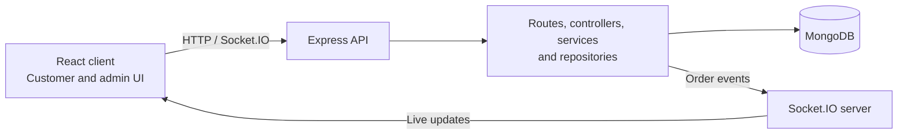

# Table & Co. Order Management

A full-stack food ordering application built as a developer assessment. Customers can browse the menu, place and track orders, while administrators manage the live order queue and delivery progress.

## Features

### Customer

- Browse available menu items and manage a cart.
- Validate delivery details at checkout and place an order.
- Track saved orders and receive live status changes.

### Admin

- Sign in to a protected order-management portal.
- View paginated orders, filter by status, advance delivery progress, and cancel eligible orders with a reason.

### Reliability / backend

- Validate request data and calculate item prices and totals from the server-side menu.
- Prevent duplicate checkout requests with idempotency keys.
- Enforce permitted server-side order status transitions.
- Persist menu items and orders in MongoDB; publish order events through Socket.IO.

## Tech Stack

- **Client:** React, TypeScript, Vite, TanStack Query, Axios, React Hook Form, Zod, Socket.IO Client
- **Server:** Node.js, Express, TypeScript, Mongoose, MongoDB, Zod, Socket.IO

## Architecture



## Local Setup

```sh
git clone https://github.com/MadhuSaini22/raftlabs.git
cd raftlabs
```

Install dependencies:

```sh
cd client
npm install

cd ../server
npm install
```

Create `client/.env`:

```dotenv
VITE_API_URL=http://localhost:8000/api/v1
VITE_SOCKET_URL=http://localhost:8000
```

Create `server/.env`:

```dotenv
MONGODB_URI=<your-mongodb-uri>
PORT=8000
CLIENT_URL=http://localhost:5173
ADMIN_EMAIL=<admin-email>
ADMIN_PASSWORD=<admin-password>
```

Start the client:

```sh
cd client
npm run dev
```

Start the server in another terminal:

```sh
cd server
npm run dev
```

## Main Functionality

- **Client-side checkout validation:** validates name, phone number, and delivery address before submission.
- **Server-side validation:** validates order payloads, identifiers, pagination parameters, and cancellation reasons.
- **Server-authoritative pricing:** resolves menu items and computes totals on the server rather than accepting client prices.
- **Idempotency:** retries using the same checkout key return the existing order instead of creating another one.
- **Order status transitions:** the server advances orders through the allowed lifecycle and rejects terminal-state changes.
- **Pagination and filtering:** the admin order list supports page-based results and status filtering.
- **Authentication:** admin routes use an authenticated session cookie.
- **Realtime order updates:** Socket.IO broadcasts new orders and status changes to the relevant customer or authenticated admin clients.

## Testing

Client:

```sh
cd client
npm test
npm run build
npm run lint
```

Server:

```sh
cd server
npm test
npm run build
```

## Live Demo

- Customer frontend: https://raftlabs-lovat.vercel.app
- Admin panel: https://raftlabs-lovat.vercel.app/admin/login
- Backend: https://raftlabs-server-qwde.onrender.com
- GitHub repository: https://github.com/MadhuSaini22/raftlabs
